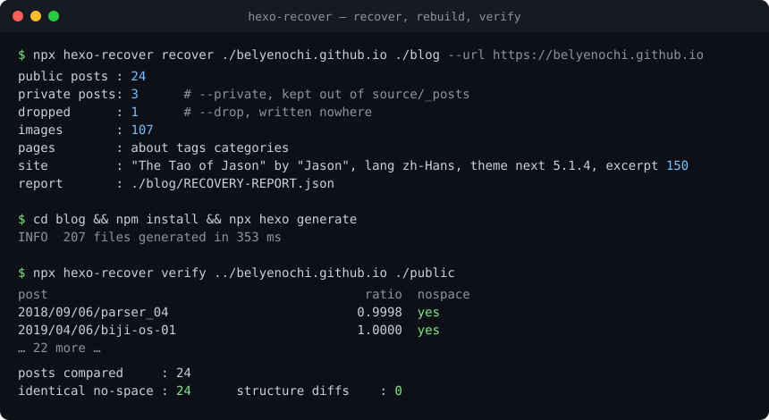
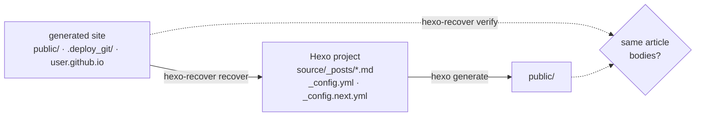

<h1 align="center">hexo-recover</h1>

<p align="center">
  Get the Markdown sources of a <a href="https://hexo.io">Hexo</a> blog back from its generated HTML — and prove nothing was lost.
</p>

<p align="center">
  <a href="https://www.npmjs.com/package/hexo-recover"></a>
  <a href="https://www.npmjs.com/package/hexo-recover"></a>
  <a href="https://github.com/Belyenochi/hexo-recover/actions/workflows/ci.yml"></a>
  = 20" src="https://img.shields.io/node/v/hexo-recover.svg?logo=node.js">
  <a href="LICENSE"></a>
</p>

<p align="center">
  
</p>

## The problem

The site is still online. The `source/` folder with the Markdown is gone — the
laptop died, the repo was never pushed, or the backup turned out to hold a
fresh `hexo init`. All you have is `public/`, `.deploy_git/`, or the
`username.github.io` repository.

Rewriting posts from rendered pages by hand is slow, and generic HTML→Markdown
converters mangle exactly what a Hexo site is made of: line-numbered code
tables, heading anchors, nested lists.

## Quick start

```sh
npx hexo-recover recover ./my-site-html ./blog --url https://you.github.io   # 1. HTML -> Hexo project
cd blog && npm install && npx hexo generate                                  # 2. build it
npx hexo-recover verify ../my-site-html ./public                              # 3. prove it matches
```

No install step: if you have Hexo you have Node, and `npx` does the rest.
Requires Node ≥ 20.

## How it works



`verify` compares every post body of the rebuilt site with the original and
exits 0 only when the text is identical (ignoring spaces) **and** every
structural tag count — headings, lists, tables, images, links, code blocks,
emphasis — matches.

## Why this works

**Hexo's output is a deterministic function of the Markdown.** `marked` turns
each Markdown construct into a fixed HTML shape, and the theme wraps it in a
fixed set of containers. Nothing about the post's *structure* is thrown away
on the way out, so it can be read back in — provided the converter knows the
exact shapes Hexo and NexT produce rather than HTML in general. That is the
whole trick: `figure.highlight > table > td.code > span.line` is a fenced code
block, `<a class="headerlink">` inside a heading is not a link, `<li><h5>` is a
heading that has to go on its own line.

**You do not have to trust it; you can measure it.** Render the recovered
Markdown with Hexo and diff every article body against the original page.
`verify` does exactly that and prints one line per post. On the 25-post site
this was built for, 24 of 24 public posts came back identical in text and
structure. If a post of yours does not, the report tells you which one and the
first place it differs.

**What is genuinely gone** and cannot come back from HTML:

- Source formatting — blank lines, which list marker you used, whether a code
  block was fenced with `` ``` `` or `~~~`. The recovered Markdown is
  equivalent, not byte-identical to what you typed.
- Raw HTML you wrote inside a post. It survives as HTML in the Markdown, which
  Hexo accepts.
- Drafts, and anything the theme never rendered.
- Theme settings that leave no trace on the page. Everything that *is* visible
  — menu, links, avatar, excerpt length, counters — is read back.

## Example

What Hexo renders for one code block, and what comes back out:

<table>
<tr><th>generated HTML</th><th>recovered Markdown</th></tr>
<tr><td>

```html
<figure class="highlight javascript"><table><tr>
<td class="gutter"><pre>
  <span class="line">1</span><br>
  <span class="line">2</span></pre></td>
<td class="code"><pre>
  <span class="line">class Parser {</span><br>
  <span class="line">  run() { … }</span></pre></td>
</tr></table></figure>
```

</td><td>

````markdown
```javascript
class Parser {
  run() { … }
```
````

</td></tr>
</table>

And a post page becomes a post file:

```markdown
---
title: "从零开始的编译原理之旅----Parser篇(四)"
date: 2018-09-06 21:39:10
categories:
  - "编译原理"
tags:
  - "parser"
---

本篇主要阐述使用递归下降非回溯或回溯解析LL(1)文法，并比较两者优缺点

### 1 目录
…
```

## What you get

```
blog/
├── _config.yml           Hexo 8 site config — title, author, language, permalink, search (read from the pages)
├── _config.next.yml      NexT 8 theme config — menu, social links, avatar, excerpt length, counters
├── package.json          Hexo 8, NexT 8, and the plugins the site evidently used
├── source/
│   ├── _posts/*.md       one file per post, front matter included
│   ├── images/           copied
│   └── about/ tags/ categories/
└── RECOVERY-REPORT.json  what was recovered, what was skipped, and why
```

## Options

| Flag | Meaning |
|---|---|
| `--url URL` | Site URL for `_config.yml`. Default: `<link rel=canonical>` if present |
| `--private PATH=WHY` | Write this post to `_private/` (gitignored) instead of publishing it. Repeatable |
| `--drop PATH=WHY` | Leave this post out entirely. Repeatable |
| `--theme next\|landscape` | Selector preset for the theme's post markup. Default `next` |
| `--body-selector CSS` | Override the article-body selector for another theme |
| `--title-selector CSS` | Override the article-title selector |
| `--post-glob GLOB` | Where post pages live. Default `YYYY/MM/DD/slug/index.html` |

`PATH` is the post's URL path, e.g. `2021/05/19/love`. Excluded posts are listed
in the report, so the decision is on file.

## Fidelity rules

Each of these is a real case from a recovered site, pinned by a test:

| Hexo markup | Handling |
|---|---|
| Code as `<table>` with a line-number gutter | Lines reassembled from `span.line`, fenced with the language |
| Bare `<pre><code>` (indented code, never highlighted) | Emitted indented, so it stays plain |
| Heading anchors `<a class="headerlink">` | Dropped |
| `<li><h5>` — heading inside a list item | Own indented line |
| `<br>` inside a list item | Continuation indented, so the list does not split |
| Literal `*` `_` `###` `1.` in prose | Escaped — but not inside headings |
| `~` in prose | `&#126;` (old marked prints `\~`; new marked pairs them as strikethrough) |
| `**[text]**` glued to a word | `<strong>` — CommonMark will not open emphasis there |
| Image file names with spaces | `%20` |

## Limitations

- Menu and social-link extraction understands the NexT sidebar. Other themes
  get correct posts and a default theme config.
- Posts are found by the date-based permalink shape unless `--post-glob` says otherwise.
- `verify` needs the rebuilt site; it does not run Hexo for you.

## Contributing

```sh
git clone https://github.com/Belyenochi/hexo-recover && cd hexo-recover
npm install
npm test
```

Bug reports with a small HTML sample and the Markdown you expected are the most
useful kind. Every fidelity rule above started as one of those.

## License

[MIT](LICENSE) © 2026 Jason Zhu
