<h1 align="center">hexo-recover</h1>

<p align="center">
  Get the Markdown sources of a <a href="https://hexo.io">Hexo</a> blog back from its generated HTML — and prove nothing was lost.
</p>

<p align="center">
  <a href="https://www.npmjs.com/package/hexo-recover"></a>
  <a href="https://github.com/Belyenochi/hexo-recover/actions/workflows/ci.yml"></a>
  
  <a href="LICENSE"></a>
</p>

<p align="center">
  
</p>

## The problem

The site is still online. The `source/` folder with the Markdown is gone — the
laptop died, the repo was never pushed, or the backup turned out to hold a
fresh `hexo init`. All you have is `public/`, `.deploy_git/`, or the
`username.github.io` repository.

Rewriting posts from rendered pages by hand is slow, and generic HTML→Markdown
converters mangle exactly what a Hexo site is made of: line-numbered code
tables, heading anchors, nested lists.

## Quick start

```sh
npx hexo-recover recover ./my-site-html ./blog --url https://you.github.io   # 1. HTML -> Hexo project
cd blog && npm install && npx hexo generate                                  # 2. build it
npx hexo-recover verify ../my-site-html ./public                              # 3. prove it matches
```

No install step: if you have Hexo you have Node, and `npx` does the rest.
Requires Node ≥ 20.

## How it works

<p align="center"></p>

Hexo's HTML is a deterministic rendering of the Markdown, so the structure can
be read back — as long as the converter knows the exact shapes Hexo emits
(line-numbered code tables, heading anchors, headings inside list items)
instead of treating it as generic HTML. The article body is the same for every
theme; only the wrapper around it differs, and the theme is detected from that
wrapper. Title, dates and tags come from the Open Graph tags Hexo writes into
every page. `verify` then renders the recovered sources and diffs every post
against the original; it exits 0 only when text and structure match. What HTML
cannot give back: your source formatting (blank lines, list markers), drafts,
and theme settings that leave no trace on the page.

## Example

What Hexo renders for one code block, and what comes back out:

<table>
<tr><th>generated HTML</th><th>recovered Markdown</th></tr>
<tr><td>

```html
<figure class="highlight javascript"><table><tr>
<td class="gutter"><pre>
  <span class="line">1</span><br>
  <span class="line">2</span></pre></td>
<td class="code"><pre>
  <span class="line">class Parser {</span><br>
  <span class="line">  run() { … }</span></pre></td>
</tr></table></figure>
```

</td><td>

````markdown
```javascript
class Parser {
  run() { … }
```
````

</td></tr>
</table>

And a post page becomes a post file:

```markdown
---
title: "Writing a Recursive Descent Parser"
date: 2018-09-06 21:39:10
categories:
  - "Compilers"
tags:
  - "parser"
---

This post walks through parsing an LL(1) grammar by recursive descent, with
and without backtracking, and compares the two.

### 1 Contents
…
```

## What you get

```
blog/
├── _config.yml           Hexo 8 site config — title, author, language, permalink, search (read from the pages)
├── _config.next.yml      NexT 8 theme config — menu, social links, avatar, excerpt length, counters
├── package.json          Hexo 8, NexT 8, and the plugins the site evidently used
├── source/
│   ├── _posts/*.md       one file per post, front matter included
│   ├── images/           copied
│   └── about/ tags/ categories/
└── RECOVERY-REPORT.json  what was recovered, what was skipped, and why
```

## Options

| Flag | Meaning |
|---|---|
| `--url URL` | Site URL for `_config.yml`. Default: `<link rel=canonical>` if present |
| `--private PATH=WHY` | Write this post to `_private/` (gitignored) instead of publishing it. Repeatable |
| `--drop PATH=WHY` | Leave this post out entirely. Repeatable |
| `--theme NAME` | Theme that generated the site. Default: detect it from the first post page |
| `--body-selector CSS` | Article-body selector, for a theme not in the list below |
| `--title-selector CSS` | Article-title selector, likewise |
| `--post-glob GLOB` | Where post pages live. Default `YYYY/MM/DD/slug/index.html` |

`PATH` is the post's URL path, e.g. `2021/05/19/love`. Excluded posts are listed
in the report, so the decision is on file.

## Themes

Detected automatically. Each one has a fixture site in `test/fixtures/themes`,
generated with the theme's current release, and the tests recover it and
`verify` it against the NexT rendering of the same posts.

| Theme | Post body, title, dates, categories, tags | Menu, avatar, social links |
|---|---|---|
| [NexT](https://github.com/next-theme/hexo-theme-next) | yes | yes |
| [Butterfly](https://github.com/jerryc127/hexo-theme-butterfly) | yes | avatar, social |
| [Fluid](https://github.com/fluid-dev/hexo-theme-fluid) | yes | menu |
| [Icarus](https://github.com/ppoffice/hexo-theme-icarus) | yes | menu |
| [Volantis](https://github.com/volantis-x/hexo-theme-volantis) | yes | yes |
| [Stellar](https://github.com/xaoxuu/hexo-theme-stellar) | yes | avatar |
| [Keep](https://github.com/XPoet/hexo-theme-keep) | yes | menu, avatar |
| [Redefine](https://github.com/EvanNotFound/hexo-theme-redefine) | yes | menu, avatar |
| [Landscape](https://github.com/hexojs/hexo-theme-landscape) | yes | menu |

Dates: when the theme prints the post's local time (or a timestamp with a
timezone offset), the front matter gets that. Butterfly, Icarus and Landscape
show only the day, so their posts get the exact instant in ISO form
(`2018-09-06T13:39:10.000Z`); set `timezone:` in `_config.yml` to the original
site's zone so the days in the permalinks come out the same.

Another theme: run with `--body-selector` pointing at the article body. The
metadata still comes from the Open Graph tags. Open an issue with one post page
and the index page and it can become a preset.

## Fidelity rules

Each of these is a real case from a recovered site, pinned by a test:

| Hexo markup | Handling |
|---|---|
| Code as `<table>` with a line-number gutter | Lines reassembled from `span.line`, fenced with the language |
| Code lines separated by `<br>` instead of `span.line` (Fluid) | Split on the `<br>` |
| Bare `<pre><code>` (indented code, never highlighted) | Emitted indented, so it stays plain |
| Heading anchors `<a class="headerlink">` | Dropped |
| `<li><h5>` — heading inside a list item | Own indented line |
| `<br>` inside a list item | Continuation indented, so the list does not split |
| Literal `*` `_` `###` `1.` in prose | Escaped — but not inside headings |
| `~` in prose | `&#126;` (old marked prints `\~`; new marked pairs them as strikethrough) |
| `**[text]**` glued to a word | `<strong>` — CommonMark will not open emphasis there |
| Image file names with spaces | `%20` |

## Limitations

- The theme config written is always NexT 8's; menu, avatar and social links
  read from another theme are carried over into it.
- Posts are found by the date-based permalink shape unless `--post-glob` says otherwise.
- `verify` needs the rebuilt site; it does not run Hexo for you.

## Contributing

```sh
git clone https://github.com/Belyenochi/hexo-recover && cd hexo-recover
npm install
npm test
```

Bug reports with a small HTML sample and the Markdown you expected are the most
useful kind. Every fidelity rule above started as one of those.

## License

[MIT](LICENSE)
